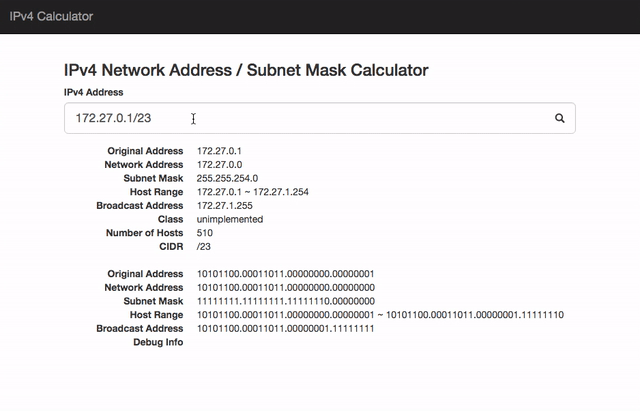

# ipv4calc

IPv4 Network Address / Subnet Mask Calculator written in TypeScript

# Demo

- [IPv4 Calculator](https://mikoim.github.io/ipv4calc/ "IPv4 Calculator")

# ToDo

## ipv4calc.ts

- [x] Parse Address String
- [x] Network Address
- [x] Subnet Mask
- [x] Host Range
- [x] Broadcast Address
- [ ] Class (and Reserved Addresses...)
- [x] Number of Hosts
- [x] CIDR
- [x] Binary Mode

## Demo

- [ ] Migrate to Vue.js

# License

- MIT License
